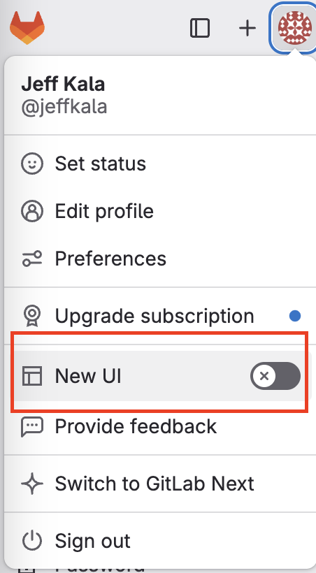
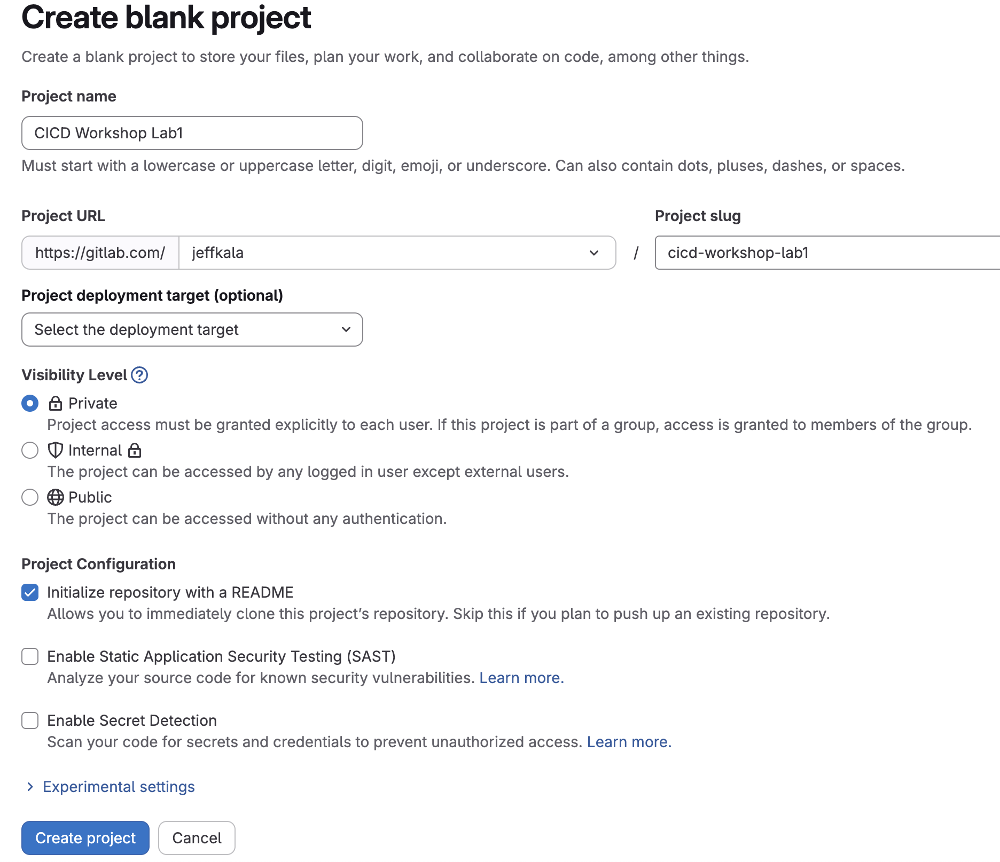
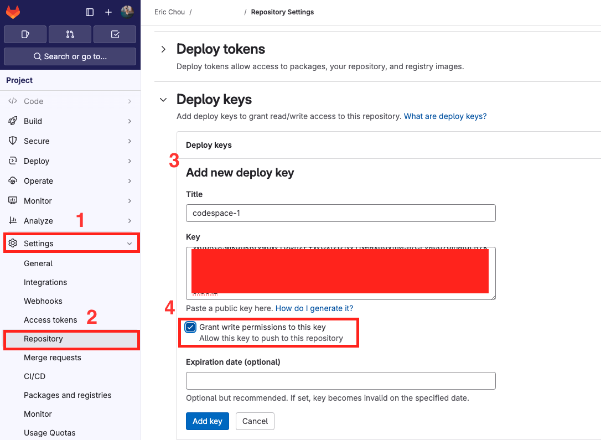
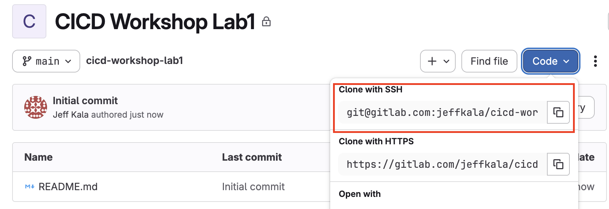
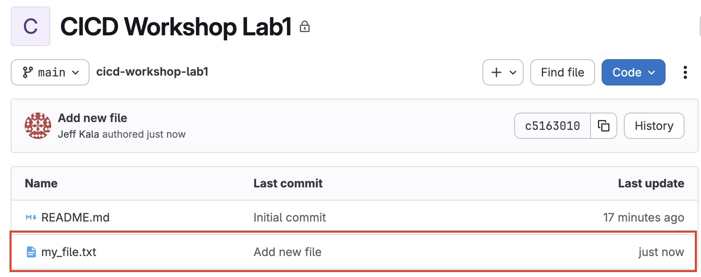
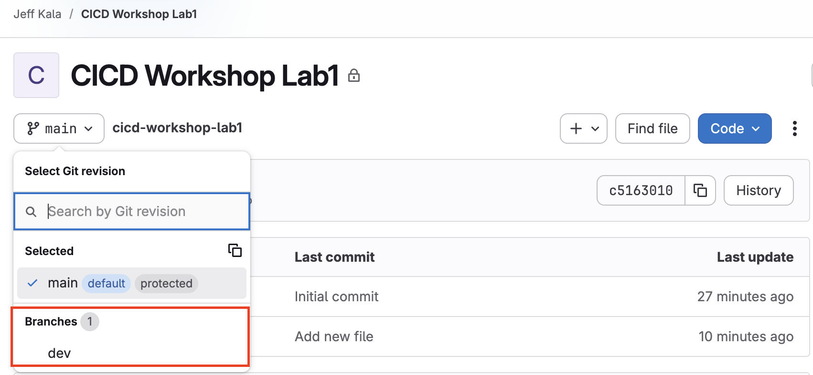
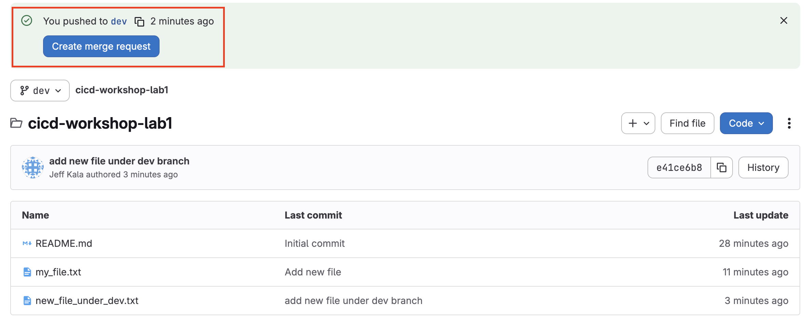
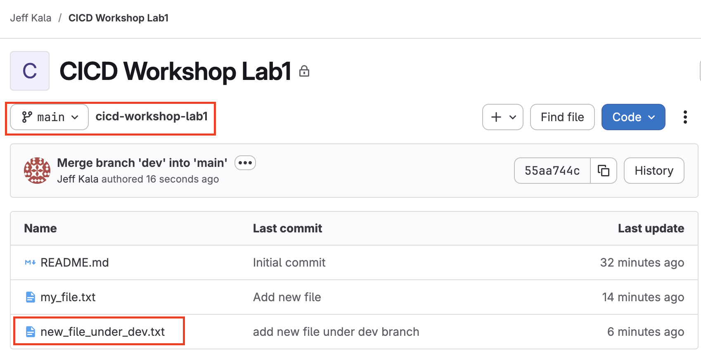

# Lab 1. Basic Git Operations

Git is a powerful version control system used by developers and DevOps engineers to manage and track changes in the code. It allows multiple people to work on the same codebase simultaneously, online or offline, without overwriting each other's work. 

Git takes snapshots of the code and at various points in time and allow each engineer to work on their local copies. This lab aims to walk thru some of the basic operations of Git. 

## GitLab

GitLab is a platform that builds on top of Git to provide more tools for development and collaboration. You might be familiar with GitHub, which is another platform that builds on top of Git. 

Why do we use GitLab instead of GitHub, especially when we are already utilize GitHub Codespace for our development platform? IMHO, when it comes to DevOps, GitLab offers some advantages over GitHub: 

- GitLab has a built-in CI/CD environment while GitHub's GitHub Actions requires more setup and needs more third-party integration to be feature-parity with GitLab. 
- GitLab runners were released around 2011 while GitHub Action was released in 2018. GitLab Runner has been around longer and is arguably more mature than GitHub Action. 
- GitHub has traditionally been focused on code hosting and collaboration while GitLab has been an all-in-one DevOps platform from the beginning with project management, issue tracking, and more. 
- GitLab offers free self-hosting option while GitHub only offers self-hosting with paid tiers.  

Having said that, GitHub offer advantages such as larger community, better integration with Microsoft Cloud, and more cost efficient. Regardless, we will use GitLab as our CI/CD platform. 

## Basic Setup

To begin with, make sure you have GitHub Codespace launched and ready to go following the instructions on the main [README](../README.md).

We should have already created a project in order to create a new runner. However, if you have not done so already, or created a project under a different name, we can create a new project from the ```+``` sign and pick 'New project/repository':

> [!New UI]
>  While updating this workshop in late 2025 GitLab is doing a canary deployment for their `New UI`, feel free to toggle it off during the setup.




Choose the option to create a blank project: 


Feel free to use any name you'd like, but we will use 'CICD Workshop Lab1' for the example: 



Now, let's take a look at making copies of the repository. 

## Understanding Repositories

As Git is a distributed technology, any copies of the codebase can be authoritative. While that sounds good on paper, it is confusing and hard to manage when any copy is the 'source of truth'. In most cases, we will designate a central repository as a place we will collectively work on. We will use this GitLab repository as our centralized location and make a copy of it locally. 

Let's come back to our codespace to set up basic Git parameters and generate ssh key for access: 

```
$ git config --global user.name "Eric Chou"
$ git config --global user.email "echou@yahoo.com"
``` 

The following steps will generate a ssh key pair for our user, we will copy the public key: 

```
$ ssh-keygen 
Generating public/private rsa key pair.
Enter file in which to save the key (/home/vscode/.ssh/id_rsa): 
Created directory '/home/vscode/.ssh'.
Enter passphrase (empty for no passphrase): 
Enter same passphrase again: 
Your identification has been saved in /home/vscode/.ssh/id_rsa
Your public key has been saved in /home/vscode/.ssh/id_rsa.pub
The key fingerprint is:
SHA256:M9TBHo1b21KTi33Ar4CmOkBjLsLLIeIMeTjWKEfYPVs vscode@codespaces-9fb312
The key's randomart image is:
+---[RSA 3072]----+
|         ..o . . |
|         .+.o *  |
| o .    ...= * = |
|. o * E.  = = + o|
|.+o+ =  So   o o |
|X=+.+   .o    .  |
|X=o. . .         |
| =    o          |
|       .         |
+----[SHA256]-----+

$ cat ~/.ssh/id_rsa.pub 
<public key text>
```

Let's add the public key to the repository by going to Settings -> Repository -> Deploy Keys, make sure we check the box for ```Grant write permission to this key```: 



We will clone this repository with ssh, go to the repository page and click on code and copy the ssh URL: 



> [!NOTE]
>  There are a few other ways to authenticate with GitLab, feel free to reference [Use SSH Key to communicate with GitLab](https://docs.gitlab.com/ee/user/ssh.html) and [Clone with SSH](https://docs.gitlab.com/ee/topics/git/clone.html) if interested.

We can now clone the repository locally in Codespace: 

```
$ git clone git@gitlab.com:jeffkala/cicd-workshop-lab1.git
Cloning into 'cicd-workshop-lab1'...
The authenticity of host 'gitlab.com (172.65.251.78)' can't be established.
ED25519 key fingerprint is SHA256:eUXGGm1YGsMAS7vkcx6JOJdOGHPem5gQp4taiCfCLB8.
This key is not known by any other names
Are you sure you want to continue connecting (yes/no/[fingerprint])? yes
Warning: Permanently added 'gitlab.com' (ED25519) to the list of known hosts.
remote: Enumerating objects: 3, done.
remote: Counting objects: 100% (3/3), done.
remote: Compressing objects: 100% (2/2), done.
remote: Total 3 (delta 0), reused 0 (delta 0), pack-reused 0 (from 0)
Receiving objects: 100% (3/3), done.
```

Once we have the local copy, we will use it as the primary workspace for our operations, then ```push``` back to the GitLab repository. 

## File Operations 

We will change into the directory and take a look, currently there is only one README.md file: 

```
$ cd cicd-workshop-lab1/
$ ls
README.md
```

Let's add a new file, optionally use an editor to add some text to the file: 

```
$ touch my_file.txt
$ vi my_file.txt 
```

The file is added, but it is not being tracked by Git. We will need to add it. We will use ```git status``` to see the status of the file and ```git add``` to add the file for tracking: 

```
$ git status
On branch main
Your branch is up to date with 'origin/main'.

Untracked files:
  (use "git add <file>..." to include in what will be committed)
        my_file.txt

nothing added to commit but untracked files present (use "git add" to track)

$ git add my_file.txt 
$ git status
On branch main
Your branch is up to date with 'origin/main'.

Changes to be committed:
  (use "git restore --staged <file>..." to unstage)
        new file:   my_file.txt
```

Now that the file is added, we will commit it with ```git commit``` and push it toward the main repository with ```git push```. The ```git remote -v``` command shows the location of the remote repository: 

```
$ git commit -m "add new my_file.txt file"
[main 2d40e95] add new my_file.txt file
 1 file changed, 1 insertion(+)
 create mode 100644 my_file.txt

$ git remote -v
origin  git@gitlab.com:jeffkala/cicd-workshop-lab1.git (fetch)
origin  git@gitlab.com:jeffkala/cicd-workshop-lab1.git (push) 

$ git push origin main
Enumerating objects: 4, done.
Counting objects: 100% (4/4), done.
Delta compression using up to 2 threads
Compressing objects: 100% (2/2), done.
Writing objects: 100% (3/3), 304 bytes | 304.00 KiB/s, done.
Total 3 (delta 0), reused 0 (delta 0), pack-reused 0 (from 0)
To gitlab.com:jeffkala/cicd-workshop-lab1.git
   66df95f..2d40e95  main -> main
```

We should now be able to see the file appeared on the GitLab repository: 



You may have noticed the ```git push origin main``` command, the ```origin``` indicates the remote repository name, the ```main``` key word indicates the "branch" we are pushing toward. Branching is what we will discuss next.  

## Branches

Remember in DevOps, we try to be collaborative and "code socially." However, we also need to protect the integrity of the code base. 

In practice, we typically use "branches" as a way to "grow" the code base, much like branches to a tree, then "merge" them back in the future date. 

Let's create a "dev" branch, and switch to it via ```git checkout```: 

```
$ git branch dev
$ git branch
  dev
* main

$ git checkout dev
Switched to branch 'dev'

$ git branch
* dev
  main
```

We can create a new file under the branch and commit it: 

```
$ touch new_file_under_dev.txt
$ git add new_file_under_dev.txt
$ git commit -m "add new file under dev branch"
[dev b2548c7] add new file under dev branch
 1 file changed, 0 insertions(+), 0 deletions(-)
 create mode 100644 new_file_under_dev.txt

$ git push origin dev
Enumerating objects: 4, done.
Counting objects: 100% (4/4), done.
Delta compression using up to 2 threads
Compressing objects: 100% (2/2), done.
Writing objects: 100% (3/3), 324 bytes | 324.00 KiB/s, done.
Total 3 (delta 0), reused 0 (delta 0), pack-reused 0 (from 0)
remote: 
remote: To create a merge request for dev, visit:
remote:   https://gitlab.com/jeffkala/cicd-workshop-lab1/-/merge_requests/new?merge_request%5Bsource_branch%5D=dev
remote: 
To gitlab.com:jeffkala/cicd-workshop-lab1.git
 * [new branch]      dev -> dev
```

Notice in the last command, we use ```git push origin dev``` to specify the new branch. 

If we navigate back to the GitLab repository, we can see the new branch appear on the page: 



We can switch to the new branch and see the new file there. However, the file will only exist in the ```dev``` branch, which is what what we wanted as we continue to develop in the ```dev``` branch. Once we are happy with all the changes, we will need to ```merge``` the change back to the ```main``` branch. That is what we will do next. 

## Merge changes in Branch

To add the file to the ```main``` branch, we will need to ```merge``` it. We can do it via the command line or the GUI, let's look at how to do it via GUI. 

When we switch to the GUI, we will see the label for "create merge request": 



If we click on it, we can fill out the fields for a new merge request: 


We can uncheck the box for deleting the branch when merged if we want to keep the branch after merge: 


On the next screen, we should see the sign for "Ready to merge": 


Once it is merged, we should be able to see it on the main branch: 



The last thing we will note in this lab is the synchronization of the code base. 

## Synchronization

As you can see, with a distributed, collaborative workforce, it is important to keep the work synchronized across different branches, both remote and local. 

Remember we merged the file remotely on GitLab? It means on our local copy, the updates are not reflected until we do a synchronization via ```git pull```. 

We can switch back to the main branch and pull the changes from remote to local: 

```
$ git branch
* dev
  main

$ git checkout main
Switched to branch 'main'
Your branch is behind 'origin/main' by 2 commits, and can be fast-forwarded.
  (use "git pull" to update your local branch)

$ git pull
Updating 2d40e95..485c581
Fast-forward
 new_file_under_dev.txt | 0
 1 file changed, 0 insertions(+), 0 deletions(-)
 create mode 100644 new_file_under_dev.txt
```

It is a good idea to make it a habit to do a ```git pull``` regularly, perhaps first thing in the morning or before you start to work on any file and merge your changes to the remote repository whenever there is a change. 

## Further Resources

As you can see, Git is a robust code development tool. We are barely cover the basic operations, it is impossible to cover all the features. Here are some of the resources for further studying of Git: 

- [Use Git](https://docs.gitlab.com/ee/topics/git/commands.html)
- Kirk Byer's [Git for Network Engineers Course](https://pynet.twb-tech.com/class-gne.html) class. 
- Book: [Version Control with Git](https://www.amazon.com/Version-Control-Git-collaborative-development/dp/1449316387/)

In the next lab, we will start to build our first CI/CD Pipeline, see you there! 
