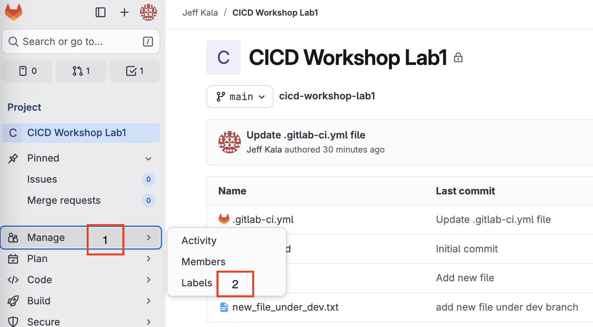
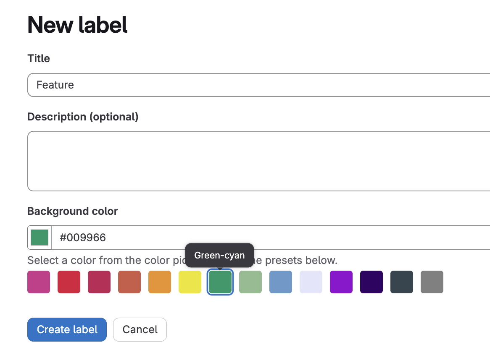
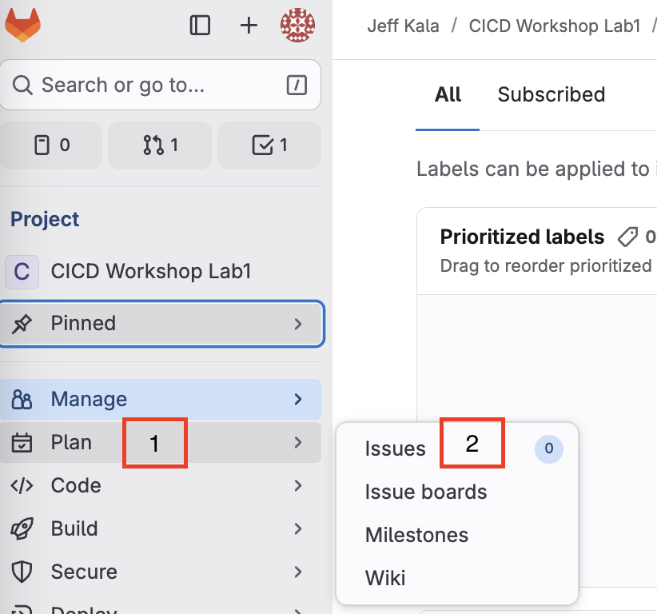
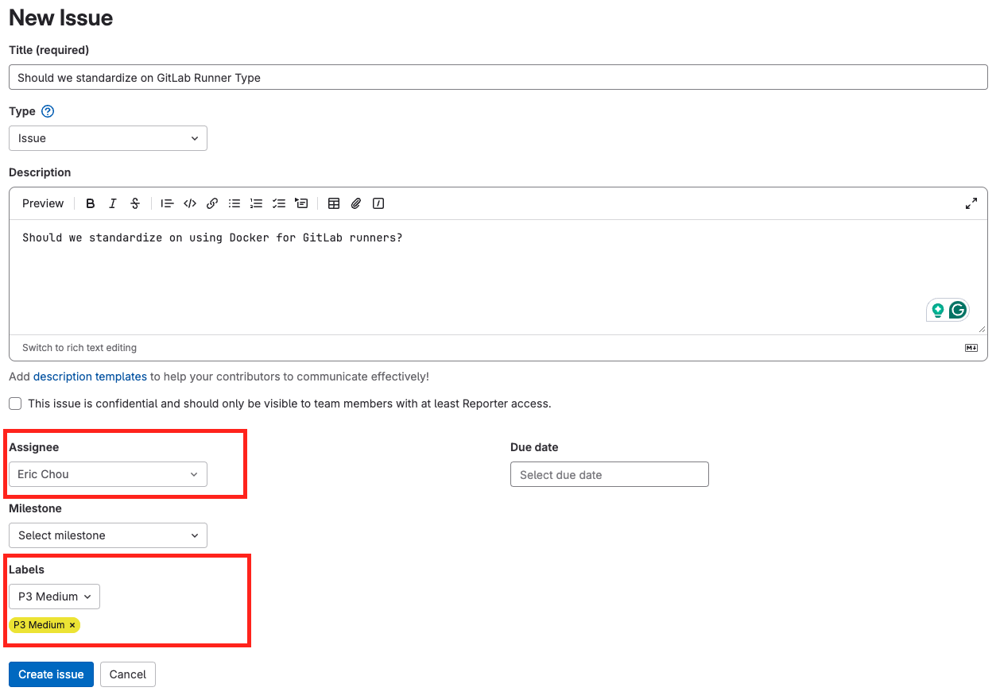
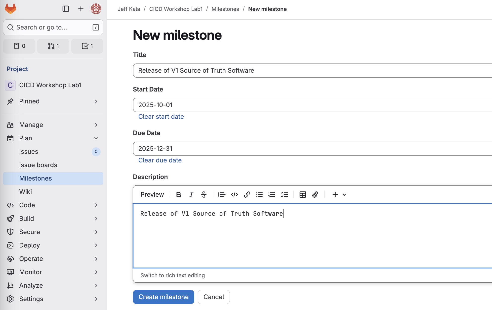
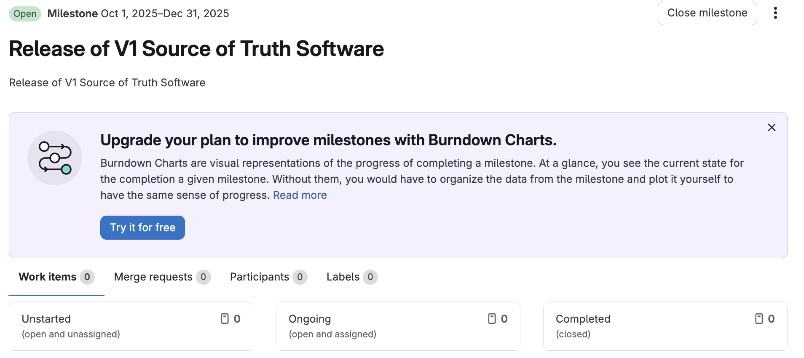
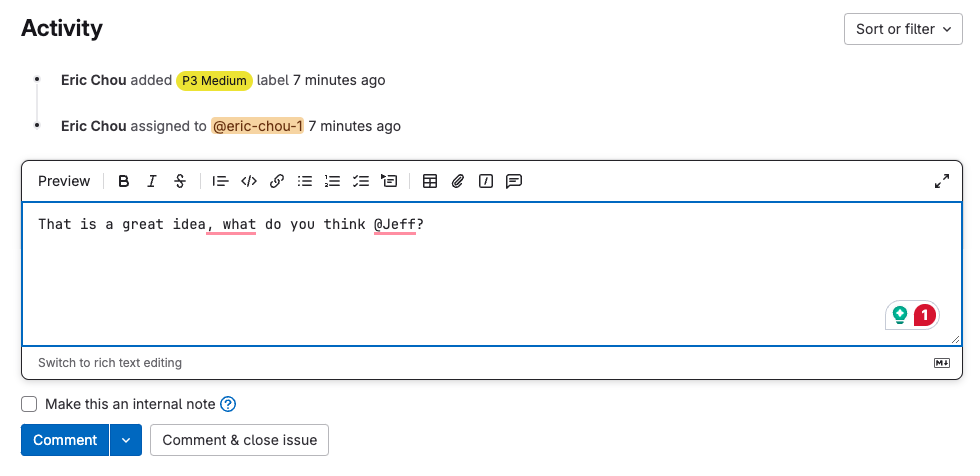
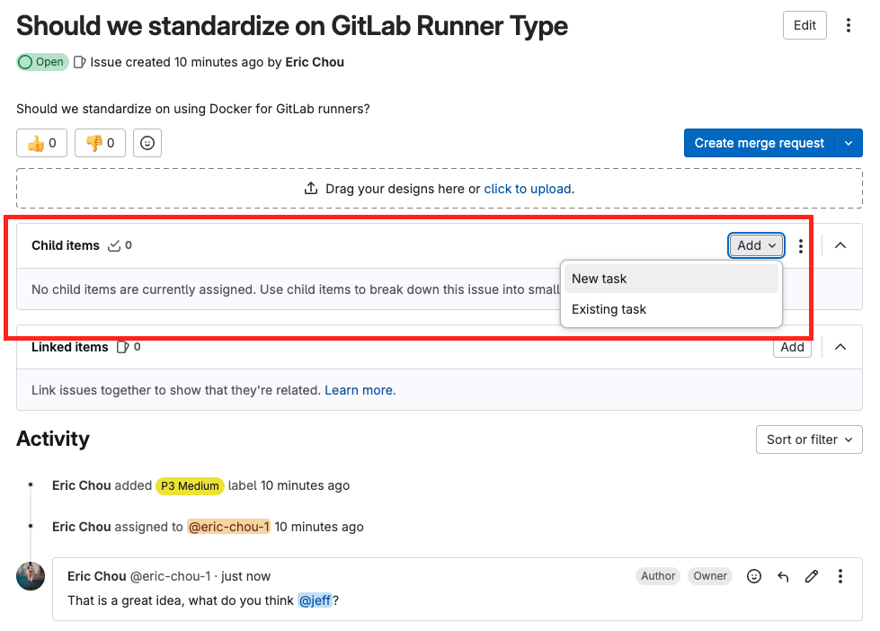
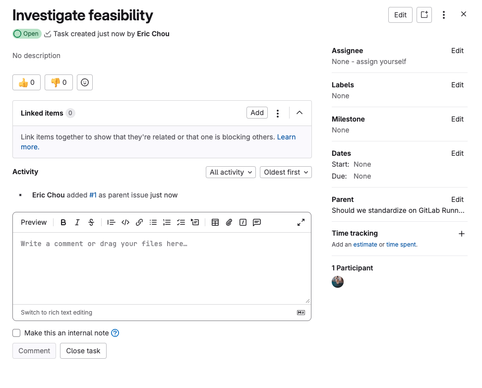

# Lab 3. Collaboration Tools

This lab is all about tools to help with team collaboration. They include: 

- [Labels](https://docs.gitlab.com/ee/user/project/labels.html)
- [Issues](https://docs.gitlab.com/ee/user/project/issues/)
- [Milestones](https://docs.gitlab.com/ee/user/project/milestones/)
- [Comments and Discussions](https://docs.gitlab.com/ee/user/discussions/)
- [Discussions](https://docs.gitlab.com/ee/user/discussions/)

Many of the features discussed here will be more useful when there are more team members. Since in this lab environment we only have one user, it is not very interesting. But it is still useful to be aware of them so we can use them when the situation requires. 

## Labels 

Labels are typically used to categoize and organize issues, requests, and anything that you want to filter on. 

https://docs.gitlab.com/ee/user/project/labels.html 

We can use labels for the following: 

- Prioriteis: P1 Critical, P2 High, P3 Medium, P4 Low, etc. 
- Status: In progress, To Do, Review, Blocked, etc. 
- Type: Bugs, Features, Documentation, etc. 

We can create labels by going to Manage -> Labels: 



Let's go ahead and create a few labels for priorities and types: 



## Issues

Issues can be used to collaborate on ideas, solve problems, or future planning:

https://docs.gitlab.com/ee/user/project/issues/. 

We can create issues with Plan -> Issues: 



Let's go ahead and create an issue, assign to yourself, and assign some labels to it. 



## Milestones

Milestones can be used to track releases or other siginificant steps to unified the team's effort: 

https://docs.gitlab.com/ee/user/project/milestones/ 

Milestones can be created under Plan -> Milestones: 



As indicated in the example, we can specify a start date, due date, and other attributes. Once created, we can also specify related issues, track times, and count merge requests toward this milestone. 




## Comments and Discussion 

There are many places we can add comments, such as in Issues, commits, designs, merge requests, etc. 

Similar to modern communication software, we can specifically mention a person in our discussion with a ```@``` sign, reply to a comment, or edit your comments: 

https://docs.gitlab.com/ee/user/discussions/ 

Let's add a comment to our previous issue: 



## Tasks and Assignments

We can also create tasks and assign it to the appropriate person: 

https://docs.gitlab.com/ee/user/tasks.html#create-a-task 

Let's add a child task to the issue we created, we can go to Plan -> Issues -> Child Items -> Add -> New Task: 



Once created, we can assign it to a person, put labels on, associate it with a milestone, create start and due dates, make comments, etc. 



## Next Steps

These are just some of the collaboration tools GitLab provide for your process. They are not by any means special to GitLab, many of the other development tools have them as well. It is good to just be aware of the different use cases and features. 

In the next lab, we will continue to develop our Pipeline and runners. 
