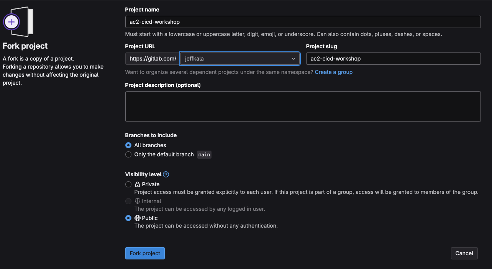
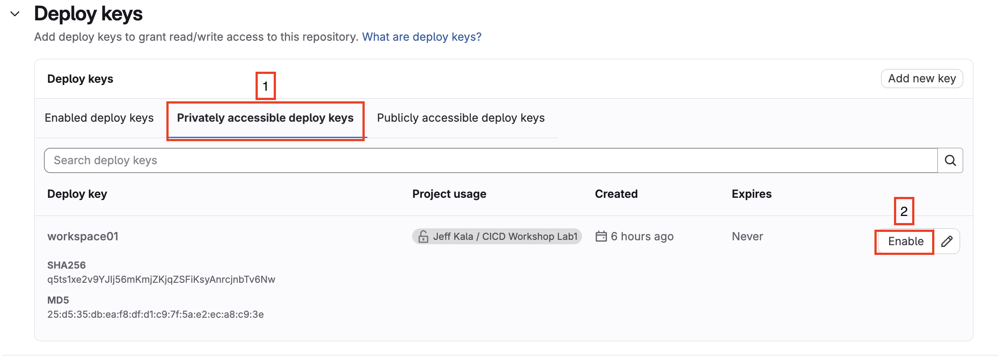
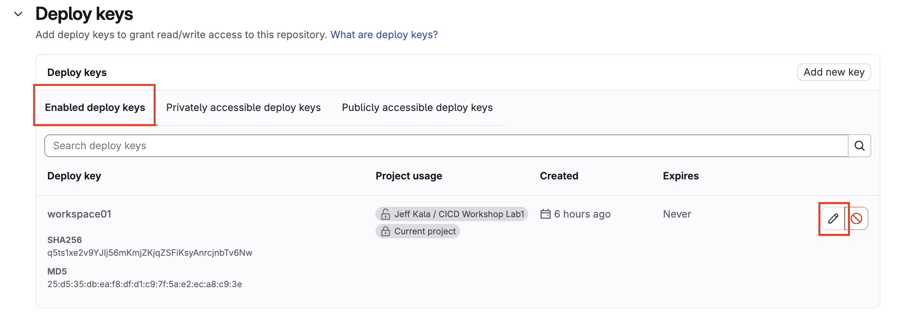
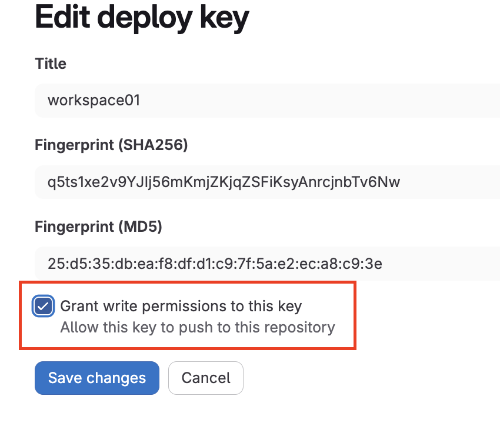
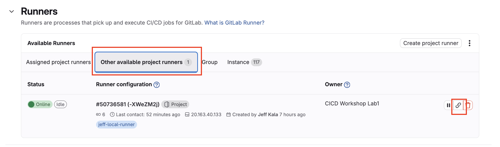

## Lab 4 Source Code Checks

During the first 3 labs we've utilized a new project and built upon it. For labs 4-6 we will use a project that we've created for you, this will help with the copy/pasting.

## Fork GitLab Repository

Navigate to the CICD boilerplate project located at: https://gitlab.com/jeffkala/workshop-implementing-cicd-pipelines

Click on the `Fork` button which is in the top right of the page.

- Select a Namespace for the Project to be forked into: (should be your GitLab username).
- Make sure `Branches to include` is set to `all`.



## Clone the GitLab Forked Project into Codespaces

Now clone the GitLab repo in to your codespace environment. This will allow everything to be managed from this single place. 

```sh
@jeffkala ➜ /workspaces/workshop-implementing-cicd (main) $ git clone git@gitlab.com:jeffkala/workshop-implementing-cicd-pipelines.git
Cloning into 'workshop-implementing-cicd-pipelines'...
remote: Enumerating objects: 597, done.
remote: Counting objects: 100% (484/484), done.
remote: Compressing objects: 100% (467/467), done.
remote: Total 597 (delta 298), reused 0 (delta 0), pack-reused 113 (from 1)
Receiving objects: 100% (597/597), 212.95 KiB | 9.68 MiB/s, done.
Resolving deltas: 100% (324/324), done.
```

Once the forked repository is cloned into codespace you will see it in your files.


From within the `workshop-implementing-cicd-pipelines` directory validate your remote is properly set.

```sh
@jeffkala ➜ /workspaces/workshop-implementing-cicd-documentation/workshop-implementing-cicd-pipelines (main) $ git remote -v
origin  git@gitlab.com:jeffkala/workshop-implementing-cicd-pipelines.git (fetch)
origin  git@gitlab.com:jeffkala/workshop-implementing-cicd-pipelines.git (push)
```

## Enable SSH Key for Project

Finally, lets allow our same `SSH Key` we generated previously in `Lab 1. Basic Git Operations`. In GitLab you do the follow:

1. Go to the `workshop-implementing-cicd-pipelines` repository and navigate to Settings -> Repository -> Deploy Keys.
2. You will notice that `Enabled Deploy Keys` tab is empty currently.  Click on `Privately accessible deploy keys` and you will see the SSH Key we setup previously. Click `Enabled`.



3. Navigate back to `Enabled Deploy Keys` and you will see the SSH key shows up now!! 



4. Finally, we edit the key and make sure we check the box for ```Grant write permission to this key```



## Enable our GitLab Runner for the Project

1. Go to the `workshop-implementing-cicd-pipelines` repository and navigate to Settings -> CI/CD -> Runners.

2. Click on `Other Project Available Runners` and click enabled for this project button.




## Run Containerlab Topology and Update the Nornir Inventory

Due to the nature of GitHub's codespaces; and the docker networking within; there is an initial requirement to update the Nornir inventory file.

1. Execute the containerlab deploy command which based on the topology file will auto assign mgmt interfaces to the lab equipment.

Navigate to clab directory:
```
@jeffkala ➜ /workspaces/workshop-implementing-cicd  (main) $ cd ../clab/
```

Start the topology:
```
@jeffkala ➜ /workspaces/workshop-implementing-cicd /clab (main) $ sudo containerlab deploy --topo ceos-lab.clab.yml 
╭─────────┬──────────────┬─────────┬────────────────╮
│   Name  │  Kind/Image  │  State  │ IPv4/6 Address │
├─────────┼──────────────┼─────────┼────────────────┤
│ ceos-01 │ arista_ceos  │ running │ 172.24.78.10   │
│         │ ceos:4.32.0F │         │ N/A            │
├─────────┼──────────────┼─────────┼────────────────┤
│ ceos-02 │ arista_ceos  │ running │ 172.24.78.11   │
│         │ ceos:4.32.0F │         │ N/A            │
├─────────┼──────────────┼─────────┼────────────────┤
│ ceos-03 │ arista_ceos  │ running │ 172.24.78.12   │
│         │ ceos:4.32.0F │         │ N/A            │
├─────────┼──────────────┼─────────┼────────────────┤
│ ceos-04 │ arista_ceos  │ running │ 172.24.78.13   │
│         │ ceos:4.32.0F │         │ N/A            │
╰─────────┴──────────────┴─────────┴────────────────╯
```

2. Now that the lab has been deployed in the Codespace environment, and we have the mgmt IPs of the equipment we must update the Nornir inventory host file with the assigned IPs.

3. To get started we will checkout the GitLab branch called `Lab_4_Source_Code_Checks` where we will update our Nornir inventory and push the code up to run the code checks.

4. Navigate and Checkout the Working Branch

From within the Codespace terminal change into the newly cloned fork.

```sh
cd ../workshop-implementing-cicd-pipelines/cicd_workshop/
```

Next, checkout the `Lab_4_Source_Code_Checks` branch.


```sh
git switch Lab_4_Source_Code_Checks
```

5. Now navigate to `cicd_workshop` --> `inventory` --> `hosts.yaml`

Validate the host definitions `hostname` field with the correct IP address from the containerlab deploy command output.

For example the file should look like this.
```yml
---
ceos-01:
  hostname: "172.24.78.10"
... omitted ...
ceos-02:
  hostname: "172.24.78.11"
... omitted ...
ceos-03:
  hostname: "172.24.78.12"
... omitted ...
ceos-04:
  hostname: "1172.24.78.13"
... omitted ...
```

## Review the Existing Pipeline

Lab 4 is all about the **project** level source code checks.

When you open the `.gitlab-ci.yml` file you will notice we have some defaults, workflow details, stages, and more.

Next, we will look at the `stages:` section which tells our pipeline what stages and what order they should be executed in.

```yml
stages:  # List of stages for jobs, and their order of execution
  - "lab-4-lint-and-format"
  - "lab-4-pytest"
```

You will finally see the `include:` section which is where we can add additional `gitlab-ci` files. We will add more files to this section throughout labs 5 and 6.

```yml
include:
  - local: ".gitlab/ci/lab-4-includes.gitlab-ci.yml"
```

Lets now review the details of that included file to see what source code checks we're running.

1. Navigate to `.gitlab/ci/lab-4-includes.gitlab-ci.yml` within the forked repository.
2. Notice that each of our jobs have a `name`, but more importantly it has a `stage` where that job name and detail is linked to a stage we had in our `.gitlab-ci.yml` file.

```yml
yamllint-job:
  stage: "lab-4-lint-and-format"
```
Each job then has an execution strategy and commands.

```yml
yamllint-job:
  stage: "lab-4-lint-and-format"
  script:
    - "echo 'Linting Nornir YAML inventory files..'"
    - "uv run invoke yamllint"
```
In this yamllint-job we're echoing a simple description, followed by running **yamllint** from within our uv environment.

3. Notice this file has all our other source code checks we want to enforce. Some simple explanations are below.

- **yamllint** - Validate all our YAML files in the project are formatted to our standards, e.g. all strings should be wrapped in double quotes.
- **j2lint** - Our source code has a Jinja2 templates directory. This directory holds all the templates we will use to generate our Arista configurations. J2Lint validates these template files follow best practices.
- **ruff** - We use ruff in two stages. The first lints and formats our source codes python files.  The second does ruff formatting checks to find python antipatterns etc.
- **pytest** - Finally, we have some basic unittest in the project that are unittest validating the source code itself. This checks only for tests under the `tests/unit` folder.

As you can see this is a ton of source code checks. It keeps our projects clean, and following best practices for multiple different file types and frameworks.

## Push our Changes and Run the Pipeline

Now that we understand lab 4, and the source code checks, lets update and run the pipeline.

These are the two assumptions before you should push your code up:

1. Ensure you've updated your Nornir inventory files from [here](README.md#run-containerlab-topology-and-update-the-nornir-inventory).
2. Navigate to the main `.gitlab-ci.yml` pipeline file and update your tag to what you deployed in the first lab.

```yml
---
default:
  image: "ghcr.io/astral-sh/uv:$UV_VERSION-python$PYTHON_VERSION-$BASE_LAYER"
  tags:
    - "jeff-local-runner"  # Update using CICD Runner Tag you used!
```

3. Commit and Push your code up!

```sh
git add -A;git commit -m "lab4 updates";git push -u origin Lab_4_Source_Code_Checks
```

4. Go into your GitLab UI and navigate to the forked project.
5. Navigate to Builds from the side menu and click on Pipelines.


6. Watch your Pipeline run


