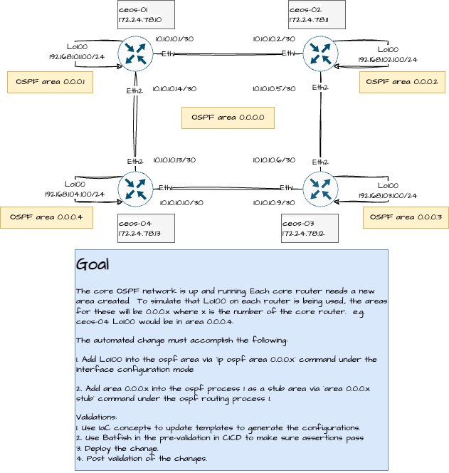
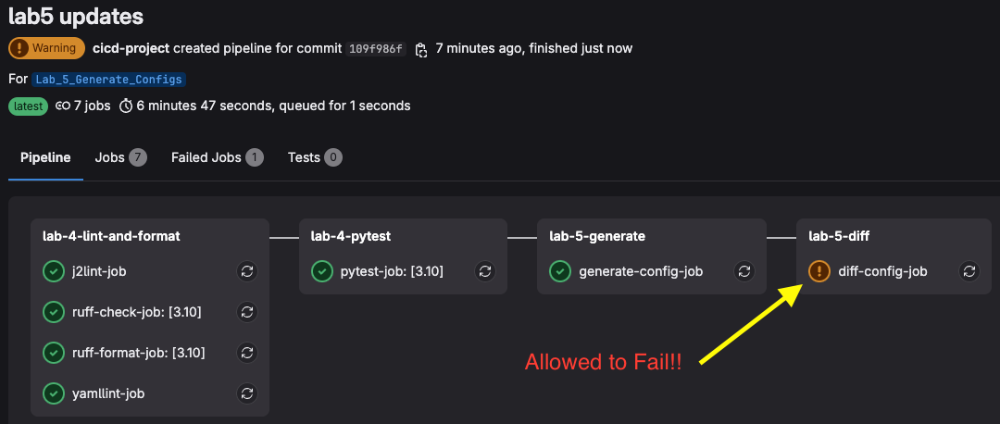

# Lab 5 - Generate Configurations with Jinja2 Templates

In lab 5 we're going to build ontop of our lab 4. Lab 4 only dealt with source code checks. We're now going to start building and testing our CICD pipeline that can actually execute some network automation!

## Checkout Lab 5 Git Branch

The first step in this lab is to checkout the Lab 5 branch from our forked repository.

1. Ensure you're in the correct GitLab forked repository directory. (./ac2_cicd_workshop)

```sh
cd ac2-cicd-workshop/ac2_cicd_workshop/
```

2. Switch into the Lab 5 Branch

```sh
git switch Lab_5_Generate_Configs
```

## Ensure Container Lab Topology is up

In Lab 4 we started our Containerlab topology. Quickly make sure that is still up and the Mgmt IPs havent changed.

```
@jeffkala ➜ /workspaces/autocon2-cicd-workshop-dev/clab (jkala-work) $ sudo containerlab inspect
INFO[0000] Parsing & checking topology file: ceos-lab.clab.yml 
+---+---------+--------------+--------------+------+---------+---------------+--------------+
| # |  Name   | Container ID |    Image     | Kind |  State  | IPv4 Address  | IPv6 Address |
+---+---------+--------------+--------------+------+---------+---------------+--------------+
| 1 | ceos-01 | 2591c2120d60 | ceos:4.32.0F | ceos | running | 172.17.0.6/16 | N/A          |
| 2 | ceos-02 | 43f7a0c03e49 | ceos:4.32.0F | ceos | running | 172.17.0.3/16 | N/A          |
| 3 | ceos-03 | 97460114f25c | ceos:4.32.0F | ceos | running | 172.17.0.5/16 | N/A          |
| 4 | ceos-04 | 9e4f783304fc | ceos:4.32.0F | ceos | running | 172.17.0.4/16 | N/A          |
+---+---------+--------------+--------------+------+---------+---------------+--------------+
```

## Review the Lab 5 Pipeline Updates

Lab 5 introduces a few elements. We will start using the source code in the repository to generate configuration utilizing the IaC concepts in the repository.

The high-level steps are listed below:
1. A click app is packaged in the `cli.py` file. It has multiple command line triggers, but we will focus on the `generate-config` function.

> [!INFO]
> This is not a python course; therefore, the code in `cli.py` won't be directly explained.

2. The generate-config function uses Nornir and two tasks exposed by public libraries.
    - `template_file` from nornir_jinja2.
    - `write_file` from nornir_utils 

3. Upon the template_file tasks being executed it find the entrypoint template called `eos.j2` and renders the Jinja2 files that build the configuration.
    - Data needed to render the templates is stored in the native Nornir inventory files, mainly in `hosts.yml`.

> [!INFO]
> The configuration change we're introducing in this lab (few steps from now) will simply require you to uncomment out some of the data attributes in the `host.yml` file.  This will allow us to save some time in the workshop delivery.

4. When you open the `.gitlab-ci.yml` file you will notice a new stage, and a new includes file has been added.

First, we will look at the `stages:` section which has two added stages.

```yml
stages:  # List of stages for jobs, and their order of execution
  - "lab-4-lint-and-format"
  - "lab-4-pytest"
  - "lab-5-generate"
  - "lab-5-diff"
```

Second, we see the `includes:` now has a new GitLab ci file to include.

```yml
include:
  - local: ".gitlab/ci/lab-4-includes.gitlab-ci.yml"
  - local: ".gitlab/ci/lab-5-includes.gitlab-ci.yml"
```
5. Lab 5 includes file has two jobs.

```yml
---
generate-config-job:
  stage: "lab-5-generate"
  script:
    - "echo 'Generating configuration files..'"
    - "poetry run python ac2_cicd_workshop/cli.py generate-config --inventory-dir ac2_cicd_workshop/inventory"

diff-config-job:
  stage: "lab-5-diff"
  allow_failure: true
  script:
    - "echo 'Diff configuration files..'"
    - "diff -y -r ac2_cicd_workshop/output/configs/ topologies/network-lab/startup-configs/"
```

You can see here, we're simply reusing our click app that we packaged with the application. We're running the click app and passing in our inventory source. This will run the Nornir tasks to generate and save the new configuration files, by default saving them in the GitLab repo directory `output`, and naming the files `<hostname>.conf`.

Secondly, we run an additional job that simply does a diff of the new configs we generated compared to startup configs. Notice we `allow_failures` on this job since its simply a documentation stage.

## Quick Config Change Explanation

Our configuration change to demonstate our CICD pipeline will be a simple OSPF change. The containerlab topology remains the same, we're simply adding Lo100 as an OSPF area and then validating our changes.

> [!INFO]
> As this is not a Network Engineering workshop, we're keeping it simple.

The diagram below explains more about the topology and the goals.



## Push our Changes and Run the Pipeline

Now that Lab 5 has been explained, lets quickly update our Nornir inventory hosts file and uncomment out a few new attributes that will render new configurations to accomplish the goals explained in the diagram!

1. Navigate to the `hosts.yml` file via `ac2_cicd_workshop/inventory/` directory.
2. For each host uncomment out the two sections.

First uncomment out the `area` definition under `Lo100`.

### Before
```yml
        Loopback100:
          description: "Mimic OSPF Area 0.0.0.4 loopback"
          ip: "192.168.104.100/24"
          # ospf:
            # area: "0.0.0.4"
```

### After
```yml
        Loopback100:
          description: "Mimic OSPF Area 0.0.0.4 loopback"
          ip: "192.168.104.100/24"
          ospf:
            area: "0.0.0.4"
```

Secondly, uncomment out the router ospf stub area configuration.

### Before

```yml
  data:
    ospf:
      process_id: 1
      router_id: "10.0.0.4"
      # stub_areas:
      #   - "0.0.0.4"
```

### After

```yml
  data:
    ospf:
      process_id: 1
      router_id: "10.0.0.4"
      stub_areas:
        - "0.0.0.4"
```

> [!INFO]
> Double check this was done for ALL four host.

3. Commit and Push your code up!

```sh
git add -A;git commit -m "lab5 updates";git push -u origin Lab_5_Generate_Configs
```

4. Go into your GitLab UI and navigate to the forked project.
5. Navigate to Builds from the side menu and click on Pipelines.


6. Watch your Pipeline run!!


