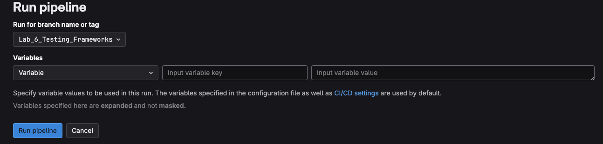

# Lab 6 Testing Frameworks

The final lab in our workshop is lab 6, we are going to finalize the pipeline. It will continue from where we left off in lab 5, by adding the following:

1. Pre-check of the generated config using Batfish.
2. Deploy the Configuration changes.
3. Use [NUTS](https://nuts.readthedocs.io/en/latest/) to do some post change validation.

## Checkout Lab 6 Git Branch

The first step in this lab is to checkout the Lab 6 branch from our forked repository.

1. Ensure you're in the correct GitLab forked repository directory. (./ac2_cicd_workshop)

```sh
cd ac2-cicd-workshop/ac2_cicd_workshop/
```

2. Switch into the Lab 5 Branch

```sh
git switch Lab_6_Testing_Frameworks
```

## Ensure Container Lab Topology is up

In Lab 4 we started our Containerlab topology. Quickly make sure that is still up and the Mgmt IPs havent changed.

```
@jeffkala ➜ /workspaces/autocon2-cicd-workshop-dev/clab (jkala-work) $ sudo containerlab inspect
INFO[0000] Parsing & checking topology file: ceos-lab.clab.yml 
+---+---------+--------------+--------------+------+---------+---------------+--------------+
| # |  Name   | Container ID |    Image     | Kind |  State  | IPv4 Address  | IPv6 Address |
+---+---------+--------------+--------------+------+---------+---------------+--------------+
| 1 | ceos-01 | 2591c2120d60 | ceos:4.32.0F | ceos | running | 172.17.0.6/16 | N/A          |
| 2 | ceos-02 | 43f7a0c03e49 | ceos:4.32.0F | ceos | running | 172.17.0.3/16 | N/A          |
| 3 | ceos-03 | 97460114f25c | ceos:4.32.0F | ceos | running | 172.17.0.5/16 | N/A          |
| 4 | ceos-04 | 9e4f783304fc | ceos:4.32.0F | ceos | running | 172.17.0.4/16 | N/A          |
+---+---------+--------------+--------------+------+---------+---------------+--------------+
```

## Review the Lab 6 Pipeline Updates

The Lab 6 steps:

1. When you open the `.gitlab-ci.yml` file you will notice new stages, and two new includes files.

First, we will look at the `stages:` section which has three added stages.

```yml
stages:  # List of stages for jobs, and their order of execution
  - "lab-4-lint-and-format"
  - "lab-4-pytest"
  - "lab-5-generate"
  - "lab-5-diff"
  - "lab-6-config-checks"
  - "lab-6-deploy"
  - "lab-6-post-deploy-checks"
```

Second, we see the `includes:` now has two new GitLab CI files to include.

```yml
include:
  - local: ".gitlab/ci/lab-4-includes.gitlab-ci.yml"
  - local: ".gitlab/ci/lab-5-includes.gitlab-ci.yml"
  - local: ".gitlab/ci/lab-6-pre-checks.gitlab-ci.yml"
  - local: ".gitlab/ci/lab-6-deploy.gitlab-ci.yml"
```

2. Lab 6 Pre Checks

In the first includes file `.gitlab/ci/lab-6-pre-checks.gitlab-ci.yml` we use Batfish as a GitLab Service within our CICD environment. We're using Batfish to do a few initial generated config checks.

- We introduce a new function into our click app `batfish-test-config` which communicates with the Batfish service, creates a snapshot with generated configs, and runs a few checks.

  - Assert the snapshot has exactly 4 nodes.
  - Assert none of the nodes have undefined_references.
  - Assert none of the nodes have unused_structures.
  - Assert no duplicate router-ids are present in OSPF.
  - Assert no incompatible OSPF sessions exist.
  - Assert exactly 4 OSPF processes exist.

> [!INFO] 
> This barely introduces what Batfish can do. Look into [Batfish](https://batfish.org/) for more information.

These steps are accomplished in the pipeline by running our click app and calling the proper function.

Our GitLab CI file looks similar to others but notice we're spinning up Batfish as a service within our pipeline!

```yml
---
batfish-check-config-job:
  stage: "lab-6-config-checks"
  services:
    - name: "batfish/batfish:latest"
      alias: "batfish"
  script:
    - "echo 'Batfish validate generated configs..'"
    - "poetry run python ac2_cicd_workshop/cli.py batfish-test-config"
```

Assuming the Batfish checks succeed. We move onto deploying the configuration to the devices.

3. Deploy the Configuration

Lab 6 introduces a `deploy-config` function to our click app. The `deploy-config` function is another Nornir task which is using `napalm_configure` from the `nornir_napalm` library.

The pipeline file simply runs this Nornir task, it takes the generated configs from Lab 5 and deploys them to the containerlab devices.

```yml
---
config-deploy-job:
  stage: "lab-6-deploy"
  script:
    - "echo 'Deploy the generated configs..'"
    - "poetry run python ac2_cicd_workshop/cli.py deploy-config"
    # when: "manual"
```

4. Use NUTS to Execute Post Checks

Finally, we will use Pytest and specifically the NUTS plugin extension to validate our OSPF changes accomplished the goal we expected.

Since NUTS is a pytest plugin, we don't need to build the underlying code to execute the test. We simply add test into our `tests` directory.

First, we create a `nuts` folder inside the `tests` directory. This allows us to seperate our pytest related test executions.

> [!INFO] 
> When we run our source code checks via pytest we don't want to run the NUTS test also.

Second, we use one of the native NUTS tests to make sure our new expected OSPF routing is working.

That file is `tests/nuts/test-definition-ping.yaml`

```yml
---
# Make sure ceos-01 can ping all the new area Lo100s
- test_class: "TestNapalmPing"
  test_execution:
    count: 5
  test_data:
    - host: "ceos-01"
      destination: "192.168.102.100"
      expected: "SUCCESS"
      max_drop: 1
- test_class: "TestNapalmPing"
  test_execution:
    count: 5
  test_data:
    - host: "ceos-01"
      destination: "192.168.103.100"
      expected: "SUCCESS"
      max_drop: 1
- test_class: "TestNapalmPing"
  test_execution:
    count: 5
  test_data:
    - host: "ceos-01"
      destination: "192.168.104.100"
      expected: "SUCCESS"
      max_drop: 1
```

This test file has ping checks to validate reachability of our new Lo100 OSPF routes.

## Execute the Full Pipeline

Since lab 5 included a push of the code, we don't have any actual changes to push. This is a bit unique to this workshop and how we're building on top of each lab.

Due to that we're going to execute lab 6 pipeline manually. 

1. Go into your GitLab UI and navigate to the forked project.
2. Navigate to Builds from the side menu and click on Pipelines.


3. Click on `New Pipeline`
4. Create a pipeline run from branch `Lab_6_Testing_Frameworks`



5. Click Run Pipeline

6. Watch your Pipeline run!!


## Closing Out

To close out the workshop, simply remember that this is just the start. You could easily add in automatic rollbacks based on post-check failures. There could also be steps update tickets, slack channels etc.

We hope you enjoyed the workshop!

- Eric, Jeff, and Tim
