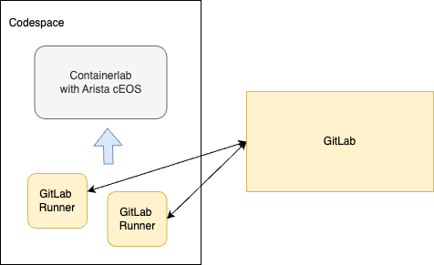
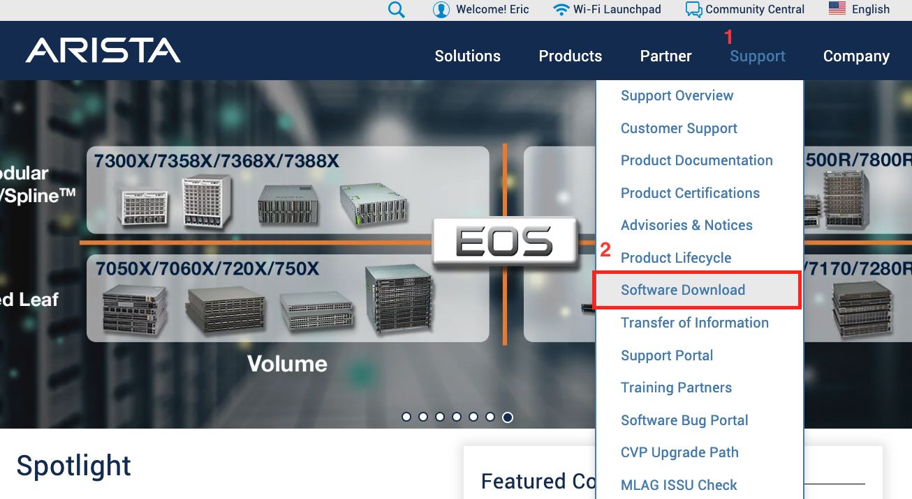
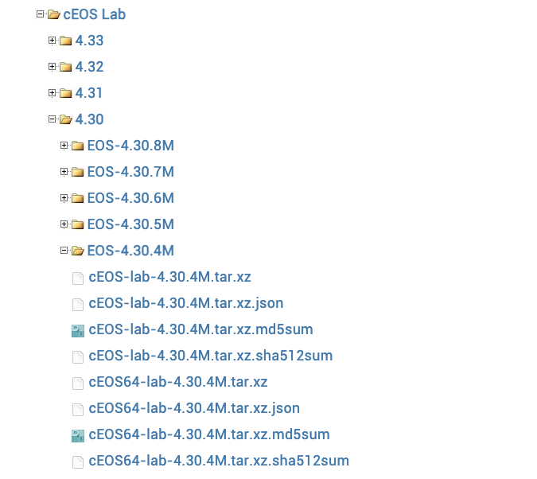
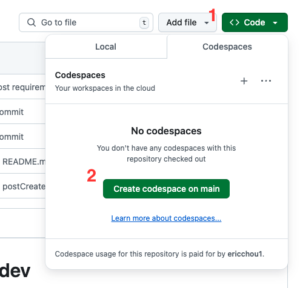
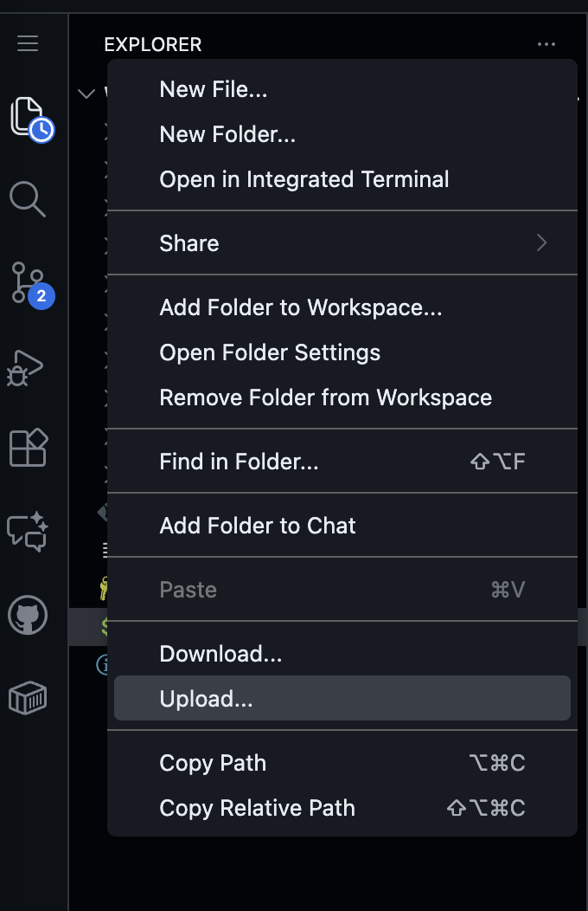
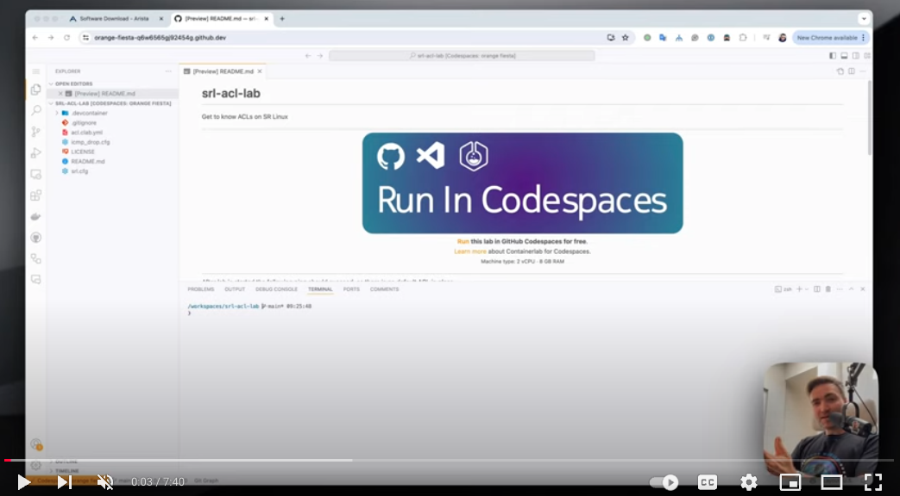

# Autocon2 CI/CD Workshop Development Repository

>[!NOTE]
> Use this repository to collaborately devlope content before publishing to user. 

Hello! Welcome to [Autocon2 CI/CD workshop](https://networkautomation.forum/autocon2#workshop) proctored by [Eric Chou](https://github.com/ericchou1/), [Jeff Kala](https://github.com/jeffkala), and assisted by [Tim Fiola](https://github.com/tim-fiola). 

You can find the different lab instructions in each of the folders in this repository. 

- [Lab 1. Basic Git Operations](./Lab_1_Basic_Git_Operations/README.md)
- [Lab 2. First Pipeline](./Lab_2_First_Pipeline/README.md)
- [Lab 3. Build Reviews](./Lab_3_Build_Reviews/README.md)
- [Lab 4. Configuration Generation with Templates](./Lab_4_Configuration_Generation_with_Templates/README.md)
- [Lab 5. ACL Change](./Lab_5_ACL_Change/README.md)
- [Lab 6. Testing Frameworks](./Lab_6_Testing_Frameworks/README.md)

But first things first, we would like to walk you through how to set up the development environment for the workshop.

## Lab Components

Here is an overview of lab:   



Here are the details regarding each components: 

- [GitLab](https://about.gitlab.com/pricing/): We will use the SaaS version of GitLab as the CI server. The CI server handles the committing, building, testing, staging, and releasing the changes. 
- [GitLab Runners](https://docs.gitlab.com/runner/): GitLab runners are workers that registers itself with the GitLab server and managed by the GitLab server. They are responsible to carry out the instructions by the GitLab server. 
- [GitHub Codespace](https://github.com/features/codespaces): We will use GitHub codepsace as our IDE as well as the virtual server to run our network lab. GitHub provides these container-based development environment for developers. We will use Containerlab to run a few network devices for our lab. GitHub offer a generous free tier in Codespace that should remain to be free for the furation of this lab. 
- [Containerlab](https://containerlab.dev/): We will use containerlab for our lab devices running inside of codepsace.  
- [Arista cEOS](https://containerlab.dev/manual/kinds/ceos/): We will use Arista cEOS for our lab for their light overhead and relative high adaption in production networks. 

## GitLab Account Registration and cEOS Download

Please do the following steps to set up the lab: 

1. Register for a free GitLab.com account [here](https://gitlab.com/-/trial_registrations/new?_gl=1%2A1c025i%2A_ga%2AMTYyOTY3MzIyLjE2ODcyNzM0MTI.%2A_ga_ENFH3X7M5Y%2AMTY4NzI3MzQxMS4xLjAuMTY4NzI3MzQxNC4wLjAuMA). 
2. Download the free Arista cEOS image [here](https://www.arista.com/en/login). The image is free but you do need to register an Arista account with your business email. We will import the Arista image Codespace later. 



Please download images later than 4.28. We will use 4.30.4M for our lab. 



> [!TIP]
You just need to download the image for now, for reference here is the import instruction from [containerlab](https://www.youtube.com/watch?v=KJMVH2okO24) and a nice walk through video from [Roman](https://www.youtube.com/watch?v=KJMVH2okO24). 

### Lab Setup

Alright, now it is time to tie everything together. 

1. In this repository, we can start Codespace by going to Code button on the top left corner and choose 'Create codespace on main': 



> [!TIP] 
> It will take a bit of time to build codespace for the first time, you can click on [building codespace](images/building_codespace.png) to check on the progress. After it started for the first time, when you stop/start the instance it will be much faster. 

Once Codespace is started, we can verify both Docker and containerlab are installed and running: 

```
@ericchou1 ➜ /workspaces/autocon2-cicd-workshop-dev (main) $ poetry --version
Poetry (version 1.8.4)

@ericchou1 ➜ /workspaces/autocon2-cicd-workshop-dev (main) $ docker run hello-world
Unable to find image 'hello-world:latest' locally
latest: Pulling from library/hello-world
...<skip>
Hello from Docker!
This message shows that your installation appears to be working correctly.
<skip>


```

2. After codespace is started, right click in the Explorer section and choose upload: 



3. Use command ```docker import cEOS64.<version>.tar.xz ceos:<version>``` to import the image, for example: 

``docker import cEOS64-lab-4.32.0F.tar.xz ceos:4.32.0F``

4. Register GitLab Runner: 
    - Get runner token via Project -> Settings -> CI/CD -> Project Runners
    - Register runner via the following command: 

```
$ gitlab-runner register  --url https://gitlab.com  --token <token>
... <skip>
Enter a name for the runner. This is stored only in the local config.toml file:
[codespaces-38d00a]: <unique name, example: echou-codespace-test1>
Enter an executor: virtualbox, docker-windows, kubernetes, docker-autoscaler, instance, custom, parallels, docker, docker+machine, shell, ssh:
<shell>
Runner registered successfully. Feel free to start it, but if it's running already the config should be automatically reloaded!
 
Configuration (with the authentication token) was saved in "/home/vscode/.gitlab-runner/config.toml"
```

### Video Demonstration

[](https://www.youtube.com/watch?v=KJMVH2okO24)


